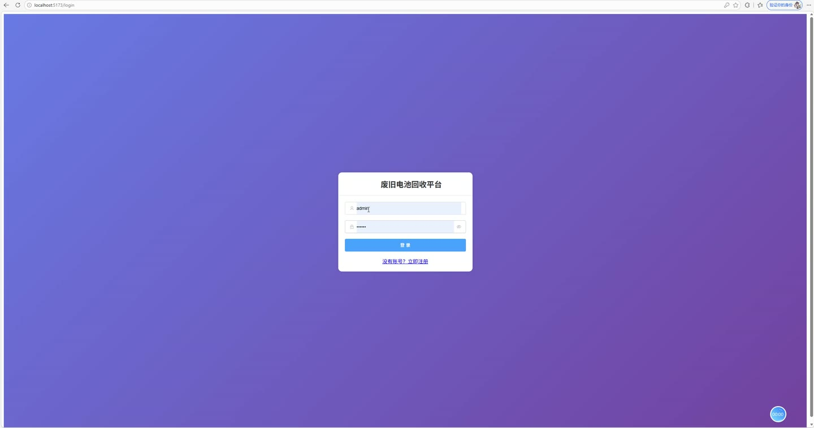
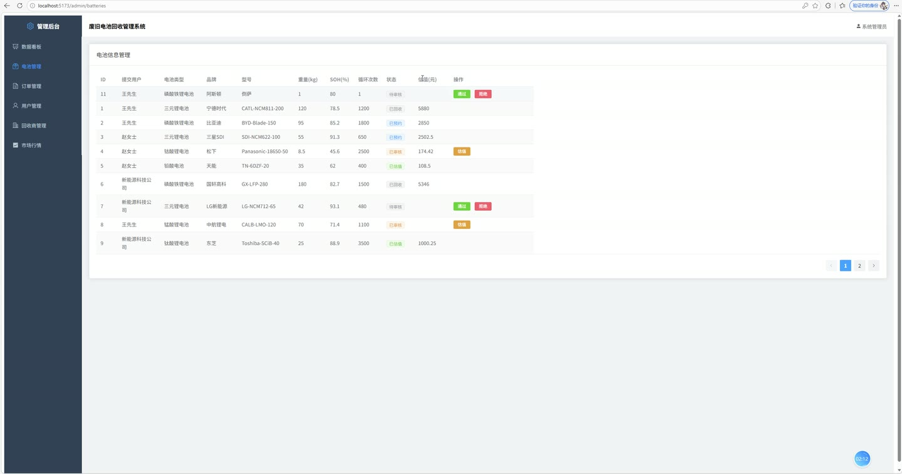
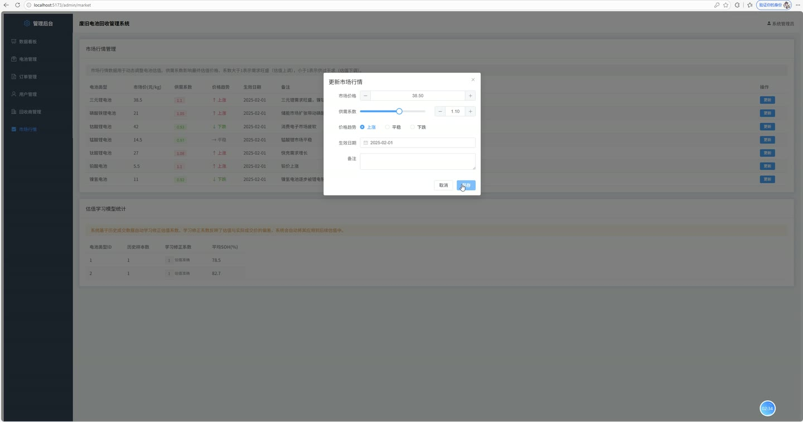
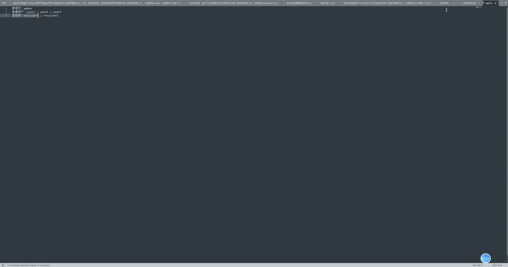
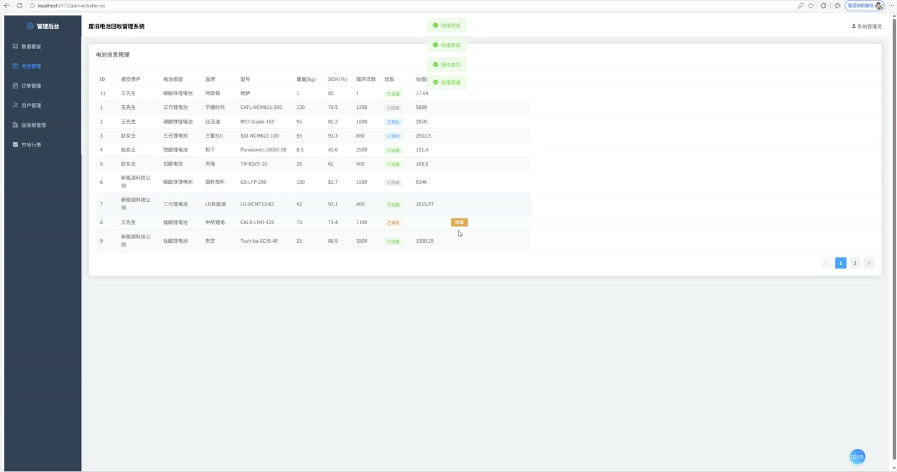
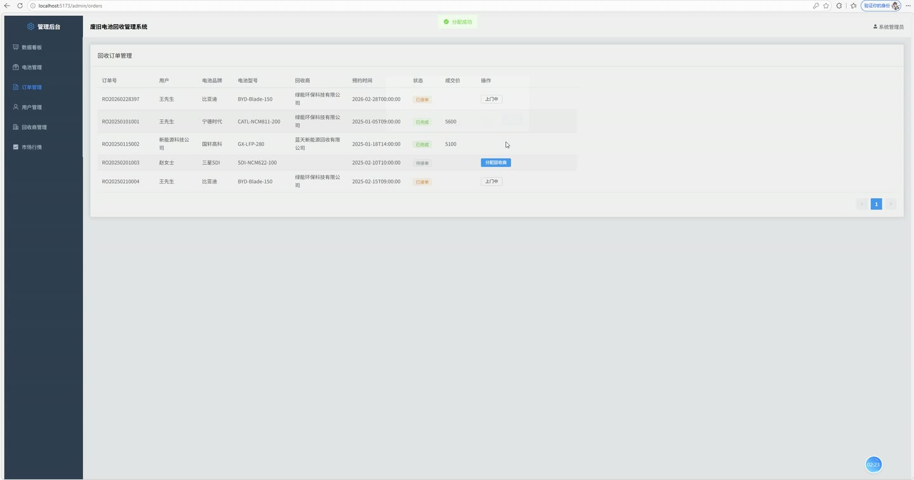

# (附文档)Springboot3+Vue3+MySQL 废旧电池回收平台

**技术栈**：Springboot3、Vue3、MySQL

### 系统简介

本系统是一个基于SpringBoot3与Vue3前后端分离架构的废旧电池回收管理平台，包含普通用户端与管理员端两大角色。平台围绕电池信息提交、智能估值、回收订单流转、积分激励、市场行情管理等核心业务展开，实现了从电池信息登记、系统自动估值、回收商接单、上门回收、订单完成到积分奖励的全流程闭环管理。系统内置估值学习模型，可根据历史成交数据动态修正估值系数，提升定价准确性。
 
### 核心功能
 
### 普通用户端

 
- 用户注册与登录：通过用户名密码完成注册，注册成功自动发放50积分奖励，登录后签发JWT令牌用于身份认证 
- 电池信息提交：填写电池类型、品牌、型号、重量、标称容量、电压、生产日期、使用年限、SOH健康度、循环次数、外观描述等字段，提交后状态为待审核，每条提交奖励100积分 
- 电池信息批量导入：支持以列表形式一次性导入多条电池信息，系统自动逐条写入并发放对应积分奖励 
- 电池列表查看：分页查看本人提交的全部电池记录，展示电池类型名称、品牌型号、重量、SOH、循环次数、审核状态、预估金额等字段 
- 智能分类推荐：输入电压、容量、重量参数，系统基于内置参数范围规则自动推荐匹配的电池类型（三元锂、磷酸铁锂、钴酸锂、锰酸锂、钛酸锂、铅酸、镍氢），并按匹配度排序返回推荐结果及匹配原因 
- 查看估值结果：查看电池的详细估值报告，包含总估值、梯次利用价值、拆解回收价值、材料价值、SOH折算系数、估值明细JSON（含基础价、市场价、供需系数、学习修正系数等参数） 
- 预约回收下单：选择已估值的电池创建回收订单，填写预约上门时间、上门地址、联系人、联系电话，系统自动生成订单编号（RO+日期+随机数），订单初始状态为待接单 
- 订单列表查看：分页查看本人回收订单，展示订单编号、电池品牌型号、回收商名称、预约时间、上门地址、最终成交价、订单状态 
- 取消订单：对未开始的订单执行取消操作，订单状态变为已取消，关联电池恢复为已估值状态 
- 积分查询：查看当前积分余额、累计获得积分、累计消费积分 
- 积分明细查看：分页查看积分变动记录，包含积分变动值、类型（注册奖励/提交奖励/回收奖励）、描述说明、关联业务ID、变动时间 
- 回收商推荐：输入地址关键词，系统基于区域匹配与地址关键词匹配度计算推荐分数，按分数排序返回推荐回收商列表，并附匹配原因说明（距离较近优先选择/可提供服务/距离较远可能产生额外运输费用）
 
### 管理员端

 
- 数据看板：查看平台核心运营指标，包括注册用户数、电池提交总数、回收订单总数、认证回收商数量、成交总额（已完成订单最终价格合计）、回收总重量（已回收电池重量合计） 
- 电池类型分布统计：以饼图展示各类型电池（三元锂、磷酸铁锂、钴酸锂、锰酸锂、钛酸锂、铅酸、镍氢）的提交数量占比 
- 订单状态分布统计：以柱状图展示待接单、已接单、上门中、已回收、已完成、已取消六种状态的订单数量分布 
- 电池审核管理：分页查看所有用户提交的电池信息（含提交用户、类型、品牌型号、重量、SOH、循环次数、状态），对待审核电池执行通过或拒绝操作，拒绝时填写审核备注 
- 电池估值操作：对已审核通过的电池执行估值计算，系统基于SOH折算系数×市场供需系数×历史学习修正系数×基础价格×重量自动生成估值，并同步更新电池的预估金额、梯次利用价值、拆解回收价值 
- 订单管理：分页查看全部回收订单（含用户昵称、回收商名称、电池品牌型号），支持指派回收商接单，更新订单状态（待接单→已接单→上门中→已回收→已完成），完成时填写最终成交价，系统自动计算并发放回收积分奖励（按成交额5%折算，最低50积分） 
- 用户管理：分页查看注册用户列表（用户名、昵称、手机号、角色、状态、注册时间），支持启用/禁用用户账号，禁用后该用户无法登录 
- 回收商管理：查看回收商列表（公司名称、执照号、所属区域、地址、联系人、月处理能力、认证信息、状态），支持审核通过或驳回回收商入驻申请 
- 市场行情管理：查看各电池类型最新市场行情（市场价元/kg、供需系数、价格趋势、生效日期），新增或更新行情记录，供需系数大于1表示需求旺盛估值上调，小于1表示供过于求估值下调 
- 估值学习模型统计：查看各电池类型的历史样本数、学习修正系数（反映估值与实际成交价的偏差，自动应用于后续估值）、平均SOH值
 
### 技术栈

 后端框架SpringBoot 3.x ORM框架MyBatis-Plus（含分页插件、自动填充） 安全认证Spring Security + JWT（BCrypt密码加密） 前端框架Vue 3（Composition API） UI组件库Element Plus 状态管理Pinia 前端路由Vue Router 4（含路由守卫） 图表库ECharts 构建工具Vite 数据库MySQL（含battery_info、battery_type、recycle_order、recycler、sys_user、market_price、valuation_record、user_points、points_record等数据表）
 
### 交付内容

 
- 后端完整源码 
- 前端完整源码 
- 数据库初始化脚本 
- 万字文档

## 界面展示

---

## 获取完整源码 + 万字文档

本仓库为项目介绍页。**完整前后端源码、数据库初始化脚本、万字项目文档**，请加微信 `kangkangcode`，或访问 [codekk.top](http://codekk.top) 获取。

可作课程设计 / 毕业设计参考，支持远程部署调试。